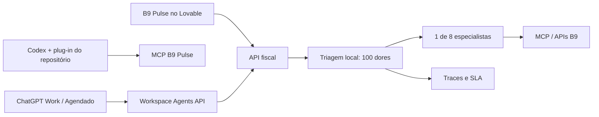

# B9 Pulse Agents

Base multiagente do B9 Pulse para diagnosticar e encaminhar problemas de faturamento fiscal em menos de cinco minutos. O runtime usa OpenAI Agents SDK, expõe o mesmo contrato já chamado pelo app Lovable e inclui um MCP/plug-in de equipe para ChatGPT e Codex.

## O que já funciona

- `POST /api/public/pulse-chat`: contrato compatível com o `PulseChat` atual do Lovable.
- Triagem local sobre um catálogo pesquisado de 100 dores fiscais.
- Oito especialistas B9: captura, validação, OC, aprovações, ciclo de vida, fornecedor/risco, integrações/compliance e monitoramento.
- Fallback determinístico sem chave de API para demos e desenvolvimento.
- MCP local com triagem, catálogo, diagnóstico de notas, busca e controle do SLA de cinco minutos.
- Plug-in de repositório com skills de triagem, resolução fiscal e integração Lovable.
- Adaptador opcional para disparar um ChatGPT Workspace Agent publicado.

## Início rápido

```bash
pnpm install
pnpm check
pnpm dev
```

Copie `.env.example` para `.env` apenas no ambiente de execução. Não versione segredos.

## Teste do endpoint

```bash
curl http://localhost:8787/health
```

Para ligar o app Lovable ao serviço publicado, siga `docs/lovable-integration.md`.

## Arquitetura



Veja o [catálogo completo das 100 dores](docs/top-100-fiscal-problems.md) e a [arquitetura](docs/architecture.md).

## Limite importante

Agent Builder está em descontinuação e será encerrado em 30/11/2026. Ele pode ser usado apenas como ponte temporária de prototipação; o runtime deste repositório usa Agents SDK para não criar uma dependência com prazo de validade.

